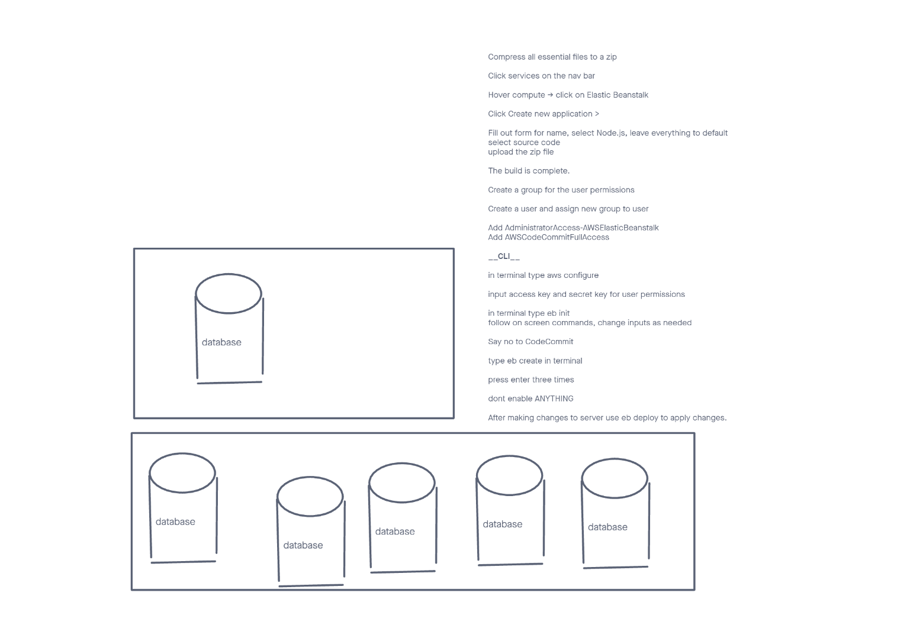

# LAB - aws-server Lab-16

## Project: Cloud-server

### Author: elias staehle

### Problem Domain

Build a basic express server, and deploy it to AWS using GUI, and beanstalk CLI

### Links and Resources

- [server-prod](http://aws-server-dev.us-east-1.elasticbeanstalk.com/)

### Setup

#### .env requirements (where applicable)

There are no env requirements

- PORT is set to process.env or 3001.
  Application will run locally or deployed to AWS without setting any parameters manually

#### How to initialize/run your application (where applicable)

- nodemon
  app.js is the primary JavaScript file for the server, and is located in the root folder.

#### Steps to deploy to AWS

Compress all essential files to a zip

Click services on the nav bar

Hover compute -> click on Elastic Beanstalk

Click Create new application >

Fill out form for name, select Node.js, leave everything to default
select source code
upload the zip file

The build is complete.

Create a group for the user permissions

Create a user and assign new group to user

Add AdministratorAccess-AWSElasticBeanstalk
Add AWSCodeCommitFullAccess

__CLI__

in terminal type aws configure

input access key and secret key for user permissions

in terminal type eb init
follow on screen commands, change inputs as needed

Say no to CodeCommit

type eb create in terminal

press enter three times

dont enable ANYTHING

After making changes to server use eb deploy to apply changes.

#### Features / Routes

- Feature one: Deploy to AWS

- GET : / - specific route to hit
- Feature two: Deploy with Beanstalk CLI

#### Tests

there are no tests at this time.

#### UML

Link to an image of the UML for your application and response to events

