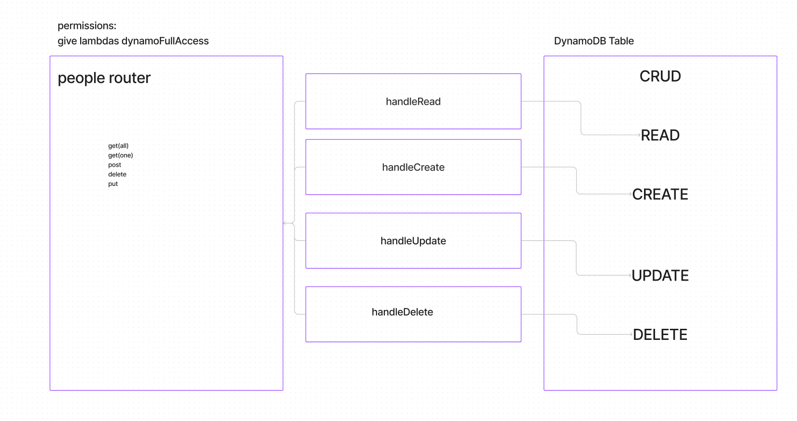

# LAB - aws-server Lab-16

## Project: Cloud-server

### Author: elias staehle

### Problem Domain

Build a new data base and create CRUD functionality for the database

### Links and Resources

- [server-prod](http://aws-server-dev.us-east-1.elasticbeanstalk.com/)

### Setup

#### .env requirements (where applicable)

There are no env requirements

- PORT is set to process.env or 3001.
  Application will run locally or deployed to AWS without setting any parameters manually

#### How to initialize/run your application (where applicable)

- nodemon
  app.js is the primary JavaScript file for the server, and is located in the root folder.

#### Steps to create crud functionality for database

1. create a new database by typing database into the search bar and clicking on dybnamo db then clicking create new table.

2. search for api gateway.

3. create new api gate way.

4. create new lambda functions for your individual crud functionality.

5. add new permissions to your new lambda functions so you have full access for CRUD

6. make sure that you attatch your new model to your data base by using your databse name and then the predefined schema.

7. test the individual functions through the api gateway.
 
#### Features / Routes

- Feature one: Deploy to AWS

- GET : / - specific route to hit
- Feature two: Deploy with Beanstalk CLI

#### Tests

there are no tests at this time.

#### UML

